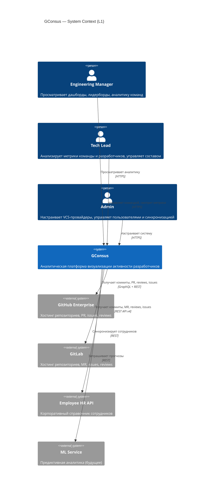
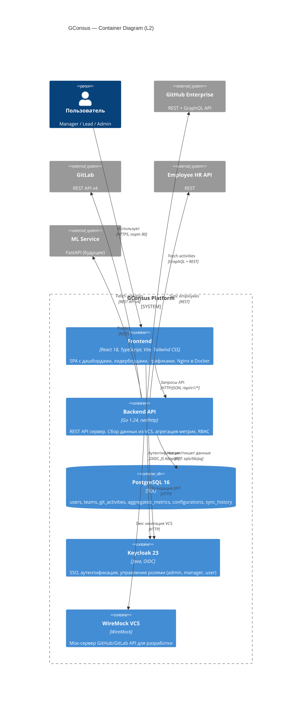

# C4 Architecture Diagrams — GConsus

## L1: System Context

Верхнеуровневый контекст: GConsus как единая система и её внешние взаимодействия.

## L2: Container Diagram

Внутренние контейнеры системы и их связи.

## L3: Component Diagram (Backend)

Внутренняя структура бэкенд-контейнера: слои handler → service → repository → adapter.

```mermaid
C4Component
    title GConsus Backend — Component Diagram (L3)

    Container_Boundary(backend, "Backend (Go 1.24)") {

        Component(server, "HTTP Server", "net/http, ServeMux", "Роутинг, CORS, middleware (JWT валидация, RBAC)")

        Component(users_h, "UsersHandler", "handler/users.go", "CRUD пользователей: POST/GET/PUT/DELETE /users")
        Component(teams_h, "TeamsHandler", "handler/teams.go", "CRUD команд + управление участниками")
        Component(analytics_h, "AnalyticsHandler", "handler/analytics.go", "Dashboard, leaderboard, user/team/repo analytics")
        Component(settings_h, "SettingsHandler", "handler/settings.go", "VCS-провайдеры, системные настройки")
        Component(sync_h, "SyncHandler", "handler/sync.go", "Статус и ручной запуск синхронизации")

        Component(user_svc, "UserService", "service/users.go", "Бизнес-логика пользователей")
        Component(team_svc, "TeamService", "service/team_service.go", "Бизнес-логика команд и участников")
        Component(analytics_svc, "AnalyticsService", "service/analytics_service.go", "Расчёт аналитики, лидерборды, скоринг")
        Component(agg_svc, "AggregationService", "service/aggregation.go", "Агрегация метрик по пользователям и командам")
        Component(settings_svc, "SettingsService", "service/settings_service.go", "Управление провайдерами и конфигурацией")
        Component(sync_svc, "SyncService", "service/sync_service.go", "Синхронизация данных из VCS-провайдеров")
        Component(scheduler, "Scheduler", "service/scheduler.go", "Cron-задачи: sync, aggregation, employee sync")

        Component(user_repo, "UserRepository", "repository/user_repository.go", "SQL: users")
        Component(team_repo, "TeamRepository", "repository/team_repository.go", "SQL: teams, team_members")
        Component(activity_repo, "ActivityRepository", "repository/activity_repository.go", "SQL: git_activities")
        Component(metrics_repo, "MetricsRepository", "repository/metrics_repository.go", "SQL: aggregated_metrics")
        Component(provider_repo, "ProviderRepository", "repository/provider_repository.go", "SQL: vcs_providers")
        Component(sync_repo, "SyncRepository", "repository/sync_repository.go", "SQL: sync_history, configurations")

        Component(github_adapter, "GitHub Adapter", "adapter/github/", "GraphQL contributionsCollection + REST API")
        Component(gitlab_adapter, "GitLab Adapter", "adapter/gitlab/", "REST API v4 (commits, MR, issues, reviews)")
        Component(vcs_iface, "vcs.Client Interface", "adapter/vcs/", "Унифицированный интерфейс VCS-адаптера")
        Component(ml_connector, "ML Connector", "adapter/ml/", "Stub-коннектор к ML-сервису (неактивен)")
    }

    ContainerDb(db, "PostgreSQL 16", "SQL")
    Container_Ext(kc, "Keycloak", "OIDC")
    System_Ext(gh, "GitHub", "API")
    System_Ext(gl, "GitLab", "API")
    System_Ext(ml, "ML Service", "API")

    Rel(server, users_h, "Роутинг")
    Rel(server, teams_h, "Роутинг")
    Rel(server, analytics_h, "Роутинг")
    Rel(server, settings_h, "Роутинг")
    Rel(server, sync_h, "Роутинг")

    Rel(users_h, user_svc, "Вызывает")
    Rel(teams_h, team_svc, "Вызывает")
    Rel(analytics_h, analytics_svc, "Вызывает")
    Rel(settings_h, settings_svc, "Вызывает")
    Rel(sync_h, sync_svc, "Вызывает")

    Rel(analytics_svc, agg_svc, "CalculateScore")
    Rel(scheduler, sync_svc, "Cron: sync activities")
    Rel(scheduler, agg_svc, "Cron: aggregate metrics")

    Rel(user_svc, user_repo, "SQL")
    Rel(team_svc, team_repo, "SQL")
    Rel(analytics_svc, metrics_repo, "SQL")
    Rel(analytics_svc, activity_repo, "SQL")
    Rel(analytics_svc, user_repo, "SQL")
    Rel(analytics_svc, team_repo, "SQL")
    Rel(agg_svc, activity_repo, "SQL")
    Rel(agg_svc, metrics_repo, "SQL")
    Rel(settings_svc, provider_repo, "SQL")
    Rel(sync_svc, activity_repo, "SQL")
    Rel(sync_svc, sync_repo, "SQL")

    Rel(sync_svc, vcs_iface, "FetchUserActivities")
    Rel(vcs_iface, github_adapter, "implements")
    Rel(vcs_iface, gitlab_adapter, "implements")
    Rel(analytics_svc, ml_connector, "Predict (future)")

    Rel(user_repo, db, "sqlx")
    Rel(team_repo, db, "sqlx")
    Rel(activity_repo, db, "sqlx")
    Rel(metrics_repo, db, "sqlx")
    Rel(provider_repo, db, "sqlx")
    Rel(sync_repo, db, "sqlx")

    Rel(github_adapter, gh, "GraphQL + REST")
    Rel(gitlab_adapter, gl, "REST v4")
    Rel(ml_connector, ml, "REST")
    Rel(server, kc, "JWT validation")
```

