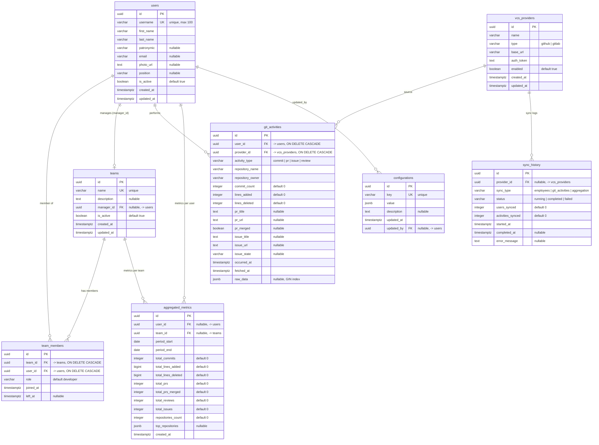

# Database Schema Design

## ER Diagram

## Table Descriptions

### users
Stores employee information from external HR API and Git systems.

**Columns:**
- `id`: UUID primary key
- `username`: VCS username (unique, up to 100 chars)
- `first_name`: Employee first name
- `last_name`: Employee last name
- `patronymic`: Employee patronymic (optional)
- `email`: Work email
- `photo_url`: URL to employee photo
- `position`: Job title
- `is_active`: Employment status
- `created_at`, `updated_at`: Timestamps

**Indexes:**
- `idx_users_username` (unique)
- `idx_users_email`
- `idx_users_is_active`

---

### teams
Developer teams/squads organization.

**Columns:**
- `id`: UUID primary key
- `name`: Team name (unique)
- `description`: Team description
- `manager_id`: Foreign key to users (team lead)
- `is_active`: Team status
- `created_at`, `updated_at`: Timestamps

**Indexes:**
- `idx_teams_name` (unique)
- `idx_teams_manager_id`

---

### team_members
Many-to-many relationship between users and teams.

**Columns:**
- `id`: UUID primary key
- `team_id`: Foreign key to teams
- `user_id`: Foreign key to users
- `role`: Member role (developer, lead, etc.)
- `joined_at`: When user joined the team
- `left_at`: When user left (NULL if active)

**Indexes:**
- `idx_team_members_team_id`
- `idx_team_members_user_id`
- `idx_team_members_active` (where left_at IS NULL)
- `uniq_team_user` (unique on team_id, user_id, left_at)

---

### vcs_providers
VCS system configurations (GitHub, GitLab).

**Columns:**
- `id`: UUID primary key
- `name`: Provider name (e.g., "GitHub Enterprise", "GitLab Main")
- `type`: Provider type (github, gitlab)
- `base_url`: API base URL
- `auth_token`: Encrypted authentication token
- `enabled`: Whether provider is active
- `created_at`, `updated_at`: Timestamps

**Indexes:**
- `idx_vcs_providers_type`
- `idx_vcs_providers_enabled`

---

### git_activities
Raw activity data from VCS providers.

**Columns:**
- `id`: UUID primary key
- `user_id`: Foreign key to users
- `provider_id`: Foreign key to vcs_providers
- `activity_type`: Type (commit, pr, issue, review)
- `repository_name`: Repository name
- `repository_owner`: Repository owner
- `commit_count`: Number of commits (for commit type)
- `lines_added`: Lines of code added
- `lines_deleted`: Lines of code deleted
- `pr_title`: Pull request title (for pr type)
- `pr_url`: Pull request URL
- `pr_merged`: Whether PR was merged
- `issue_title`: Issue title (for issue type)
- `issue_url`: Issue URL
- `issue_state`: Issue state
- `occurred_at`: When activity happened
- `fetched_at`: When we fetched this data
- `raw_data`: JSONB with full API response

**Indexes:**
- `idx_git_activities_user_id`
- `idx_git_activities_provider_id`
- `idx_git_activities_type`
- `idx_git_activities_occurred_at`
- `idx_git_activities_repository`
- `idx_git_activities_raw_data` (GIN index for JSONB)

---

### aggregated_metrics
Pre-calculated metrics for performance.

**Columns:**
- `id`: UUID primary key
- `user_id`: Foreign key to users (NULL for team-level)
- `team_id`: Foreign key to teams (NULL for user-level)
- `period_start`: Period start date
- `period_end`: Period end date
- `total_commits`: Total commits count
- `total_lines_added`: Total lines added
- `total_lines_deleted`: Total lines deleted
- `total_prs`: Total pull requests
- `total_prs_merged`: Total merged PRs
- `total_reviews`: Total code reviews
- `total_issues`: Total issues created
- `repositories_count`: Unique repositories count
- `top_repositories`: JSONB with top repositories and their stats
- `created_at`: When metrics were calculated

**Indexes:**
- `idx_aggregated_metrics_user_id`
- `idx_aggregated_metrics_team_id`
- `idx_aggregated_metrics_period`
- `uniq_aggregated_metrics` (unique on user_id, team_id, period_start, period_end)

---

### configurations
Application configuration key-value store.

**Columns:**
- `id`: UUID primary key
- `key`: Configuration key (unique)
- `value`: Configuration value (JSONB)
- `description`: Human-readable description
- `updated_at`: Last update timestamp
- `updated_by`: User ID who updated

**Indexes:**
- `idx_configurations_key` (unique)

**Example configs:**
- `sync_schedule`: Cron expression for sync jobs
- `employee_api_url`: External HR API endpoint
- `default_period_days`: Default analytics period

---

### sync_history
History of synchronization jobs.

**Columns:**
- `id`: UUID primary key
- `provider_id`: Foreign key to vcs_providers (NULL for employee sync)
- `sync_type`: Type (employees, git_activities, aggregation)
- `status`: Status (running, completed, failed)
- `users_synced`: Number of users synced
- `activities_synced`: Number of activities synced
- `started_at`: Job start time
- `completed_at`: Job completion time
- `error_message`: Error details if failed

**Indexes:**
- `idx_sync_history_provider_id`
- `idx_sync_history_type`
- `idx_sync_history_status`
- `idx_sync_history_started_at`

---

## Partitioning Strategy

For large datasets, consider partitioning `git_activities` by `occurred_at` (monthly or quarterly partitions).

## Retention Policy

- `git_activities`: Keep raw data for 2 years
- `aggregated_metrics`: Keep indefinitely
- `sync_history`: Keep for 6 months
